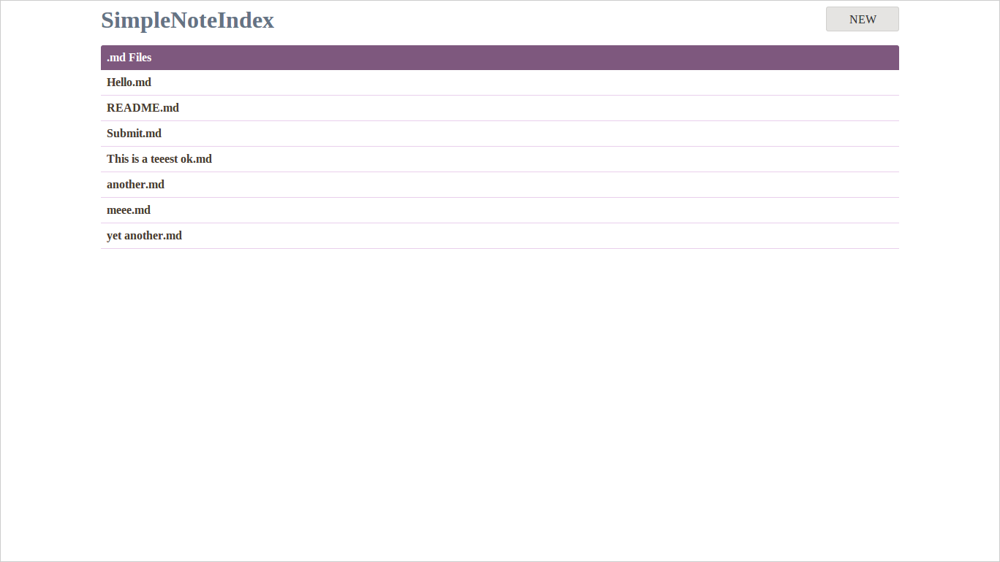

SimpleNoteIndex
=====================

Simple and beautiful formatted note directory using markdown syntax.

## Features

* Simple `index.php` and `stylesheet.css`.
* Lets you list, edit and create MD formatted files.
* Uses Parsedown + Parsedown Extra.

### index.php - Listing .md Files



### Editing File


### Creating File


## Requirements

* A private web server with PHP installed --- as it does not use login.

## Usage

Clone this repository inside the web server. **Make sure that only you have access to your web server**

```
git clone https://github.com/kassius/SimpleNoteIndex.git MyNotes
```

Then open the index.php with the browser, it will list the .md files inside the directory, and you can create a new file clicking the 'NEW' button, or edit existing files.

You can remove `.git/` and `screenshots/` directories.
You can remove the `stylesheet.css` file and leave only the index.php and your .md notes, and it will embed the css inline, from the .php

## Notes

This program has no feature for deleting files, only for creating and editing.

## Tips and tricks

Why don't you remove the screenshots directory when cloning the repository?
